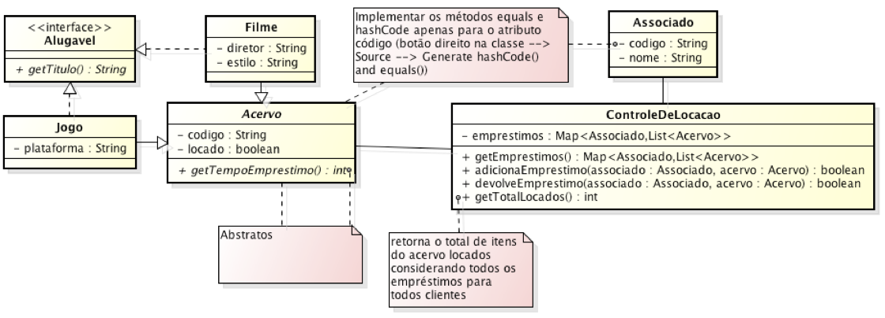

# Apache MAVEN  
 - [Material de Aula](https://lpoo2.github.io/aulas/maven/)
 
## Exercício:
 
*Em um projeto do Maven, implemente a estrutura abaixo juntamente com o teste unitário para a classe ControleDeLocacao usando a API AssertJ, Junit 4x com o JDK 8.*
    

